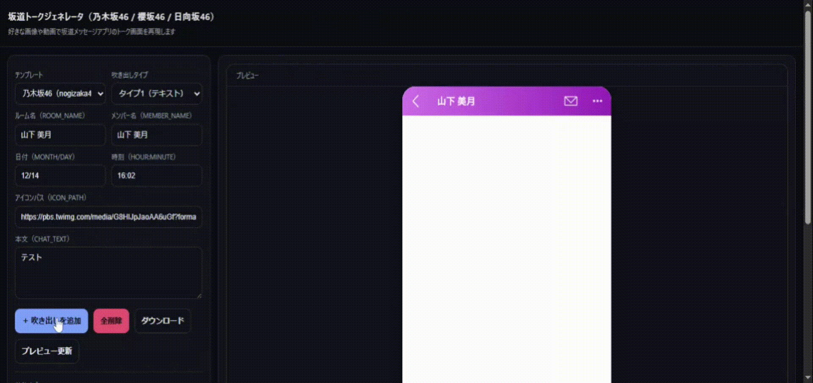
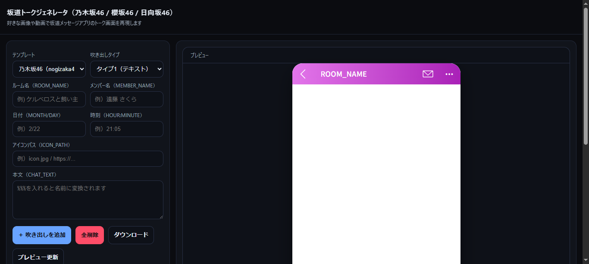
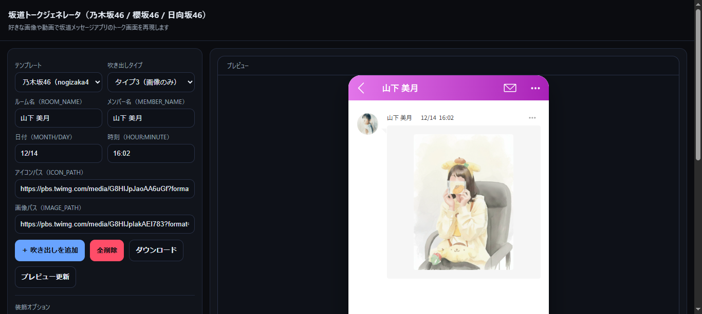
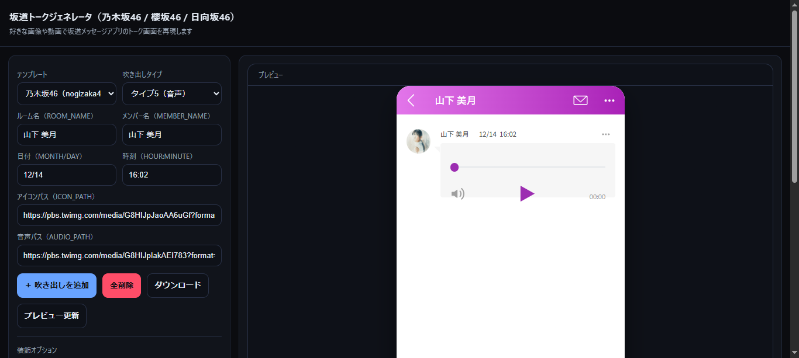
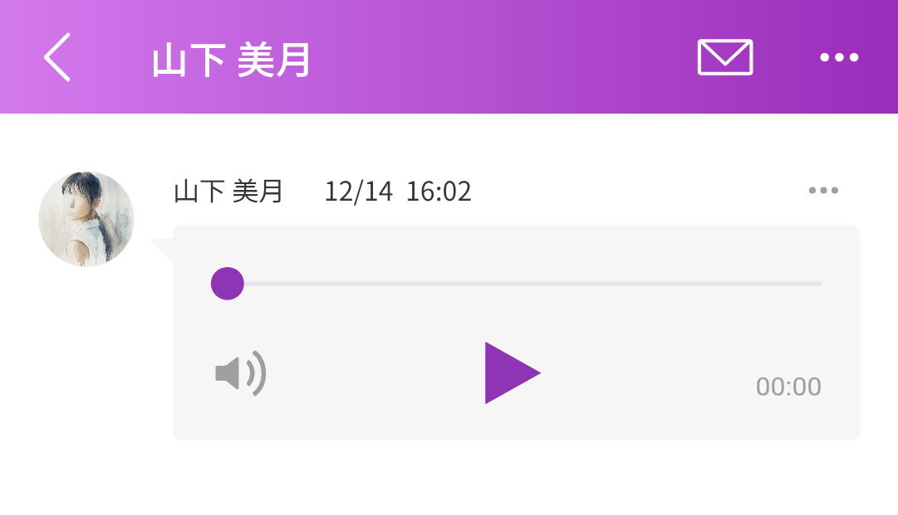
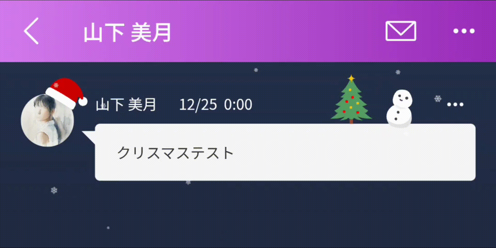

# 坂道トークメーカー◢ ￨⁴⁶

乃木坂46 / 櫻坂46 / 日向坂46  
好きなテキスト・画像・動画・音声で  
公式メッセージアプリ風の HTML ファイルを作成できる Web ツールです。  
操作に迷うような複雑な作りではないですがreadmeを書いた方がそれっぽくなるので書きます。

👉 **ツールはこちらからどうぞ**  
https://ra-ly123.github.io/46msg-maker/

---

## 📑 目次
- [概要](#-概要)
- [使い方](#-使い方)
- [プレビュー表示について](#-プレビュー表示について)
- [注意事項](#-注意事項)
- [ライセンス](#-ライセンス)

---

## 📘 概要

- 公式メッセージアプリの UI / レイアウトを再現  
- ユーザーが入力した内容（テキスト・画像・動画・音声）を反映  
- HTML として書き出し可能  
- ブラウザ上で完結、インストール不要  

---

## ▶ 使い方

### 1. ページにアクセス

以下の URL にアクセスします：

https://ra-ly123.github.io/46msg-maker/

---

### 2. 各種コンテンツを選択・入力

入力画面から、挿入する吹き出しをカスタマイズ

- テンプレート
- 吹き出しタイプ
- ルーム名
- メンバー名
- アイコンパス
- メディアパス
- メッセージ本文

・各種パスはURLでのオンラインファイル設定、相対パスでのローカルファイル設定どちらも可能です。  
・テキストに%%%を入力すると公式アプリの名前呼びを再現できます。（呼ばれたい名前はヘッダー右上の3点リーダーから変更できます）

---

### 3. プレビューで確認

入力内容はその場でプレビューに反映され、  
実際のアプリ画面に近い形で表示されます。

※ ローカルファイルを設定した場合、プレビューに反映されないのでご注意ください。

---

### 4. HTMLとして保存

完成したページは HTML として保存できます。  
保存した HTML をブラウザで開くことで、公式メッセージアプリと近い操作感でオリジナルトークを閲覧できます。  

---

完成 HTML イメージ

---

※ 吹き出しにローカルファイルを設定した場合、スマホでそのファイルを閲覧するにはサーバーを立てる必要があります。最近は簡単にサーバーを立てられるアプリ（Simple HTTP Server等）がありますが、 HTML だけで完結させたい場合はオンラインファイルだけで吹き出しを作成してください。

---

## 🔍 プレビュー表示について

本ツールのプレビューは `iframe` を使用しています。

**環境やブラウザによっては  
プレビュー画面でズレが生じる場合があります。**

- 行間
- 要素の位置
- 縦、横幅の計算
- 各種アイコンのレイアウト

などが、実機表示と一致しないことがあります。  
割と直そうとはしたんですが作者の腕じゃ届きませんでした無念(｡-人-｡)  

⚠ **ただし**  
HTML として保存した完成データでは  
意図したレイアウトで正しく表示されます。

あくまでプレビューは「確認用」としてご利用ください。

※ ↑プレビューでずれているレイアウト

※ ↑スマホで開いた完成 HTML

---

## 🎄 おまけ要素について

ツール作成が12月だったため、  
クリスマス気分の作者が期間限定っぽい装飾ができる機能をつけています⛄

おまけ程度にご利用ください。

---

## ⚠ 注意事項

- 本ツールは 乃木坂46／櫻坂46／日向坂46 風のトーク画面を それなりのクオリティで再現する非公式ツール です。実際の公式アプリとは関係ありません。
- 自身で用意した テキスト・画像・動画・音声 を使って自由にカスタマイズできますが、素材の著作権や肖像権を侵害することがないようご注意ください。
- 本ツールで生成した画面を、事実であるかのように公開・拡散する行為はお控えください。
- 素人が趣味で作ったツールなので、細かい不具合がある可能性があります。ご了承ください。

---

## 📄 ライセンス

MIT License
